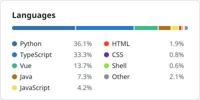
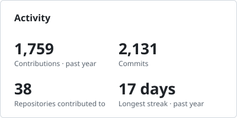

# Hi, I'm Martin 👋

Web developer from Czechia with a soft spot for the backend.
I also teach programming at MENDELU: Javascript/Typescript, Java, Python.

  

## My projects

| Project | What it is |
|---|---|
| **P.A.R.K.** | Admin system for a Cambridge language-exam centre: exam scheduling, examiner and invigilator availability, documents and PDF reports. Started as my bachelor's thesis. Vue 3 · Quasar · Express · Prisma · PostgreSQL · JWT with 2FA · Microsoft Graph · private repo |
| **[My MENDELU](https://my.mendelu.cz/)** | University portal for students and graduates. I'm the product owner of the web part and build and run it end to end: backend, database, two frontends (students and graduates) and the DevOps. private repo |
| **[Henry](https://github.com/Juryyy/Henry)** 🚧 | Self-hosted fitness PWA: weekly step debt, exercise blocks and push notifications that arrive even when the app is closed. Work in progress. Vue · Express · TypeScript · WebAuthn · Web Push |
| **[warehouse-simulation](https://github.com/Juryyy/warehouse-simulation)** | Mini project: an automated warehouse with AGV robots, simulated with SimPy and shown in 3D with Panda3D. Python · SimPy · Panda3D |

## By the numbers

Including private repositories · updated daily

  <picture>
    <source media="(prefers-color-scheme: dark)" srcset="assets/languages-dark.svg">
    
  </picture>
  <picture>
    <source media="(prefers-color-scheme: dark)" srcset="assets/activity-dark.svg">
    
  </picture>

